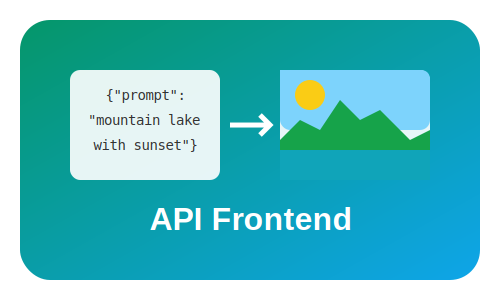
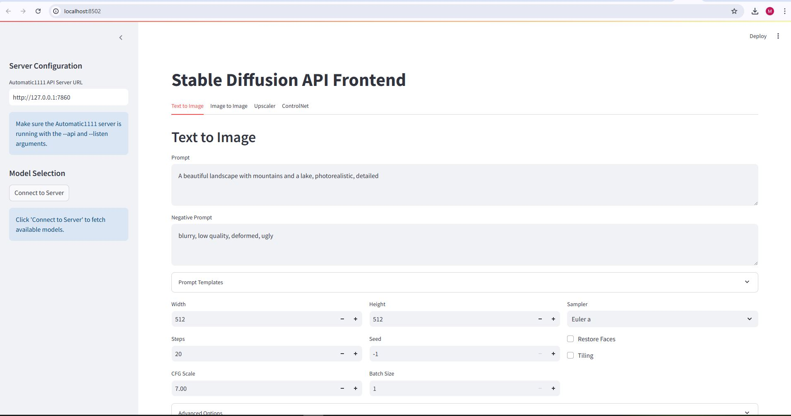

# Text-to-image (Stable Diffusion/Flux.ai) API Frontend

A user-friendly web interface for Stable Diffusion/Flux.ai using Streamlit. This application serves as a frontend for the AUTOMATIC1111 Stable Diffusion API.




## Features

- **Text to Image** - Generate images from text prompts with template support
- **Image to Image** - Transform uploaded images using text prompts
- **Upscaler** - Enhance your images with various upscaling models
- **ControlNet** - Use input images to control generation with models like canny, depth, pose
- **Model Selection** - Choose from any model available on your SD server
- **Advanced Controls** - Fine-tune generation parameters:
  - Sampling methods
  - CFG scale
  - Steps
  - Dimensions
  - Face restoration

## Installation

### Prerequisites

- Python 3.8 or higher
- A running instance of [AUTOMATIC1111's Stable Diffusion WebUI](https://github.com/AUTOMATIC1111/stable-diffusion-webui) with API access enabled

### Option 1: Direct Installation

1. Clone this repository:
```bash
git clone https://github.com/Shivp1413/stable-diffusion-frontend.git
cd stable-diffusion-frontend
```

2. Install the required dependencies:
```bash
pip install -r requirements.txt
```

3. Run the application:
```bash
streamlit run app.py
```

### Option 2: Docker Installation

1. Clone this repository:
```bash
git clone https://github.com/Shivp1413/stable-diffusion-frontend.git
cd stable-diffusion-frontend
```

2. Build and run using Docker Compose:
```bash
cd docker
docker-compose up -d
```

## Usage

1. Start your AUTOMATIC1111 Stable Diffusion WebUI with API access:
```bash
python launch.py --api --listen
```

2. Access the Streamlit frontend at `http://localhost:8501`

3. Enter the URL of your Stable Diffusion API server (default: http://127.0.0.1:7860)

4. Click "Connect to Server" to fetch available models

5. Start generating images!

## Configuration

- The application saves your server URL in a `config.json` file for convenience
- Each tab has specific options related to its functionality
- Advanced settings are available in collapsible sections

## Project Structure

```
stable-diffusion-frontend/
├── app.py                 # Main application file
├── modules/               # Modular components
│   ├── __init__.py        # Package initialization
│   ├── server_config.py   # Server configuration module
│   ├── text_to_image.py   # Text to Image tab implementation
│   ├── image_to_image.py  # Image to Image tab implementation
│   ├── upscaler.py        # Upscaler tab implementation
│   └── controlnet.py      # ControlNet tab implementation
├── requirements.txt       # Python dependencies
├── docker/                # Docker configuration
│   ├── Dockerfile         # Docker build file
│   └── docker-compose.yml # Docker setup
└── screenshots/           # Application screenshots
```

## Contributing

Contributions are welcome! Please feel free to submit a Pull Request.

## License

This project is licensed under the MIT License - see the LICENSE file for details.

## Acknowledgements

- [AUTOMATIC1111's Stable Diffusion WebUI](https://github.com/AUTOMATIC1111/stable-diffusion-webui)
- [Streamlit](https://streamlit.io/) for the web framework
- [Stable Diffusion](https://stability.ai/stable-diffusion) by Stability AI
